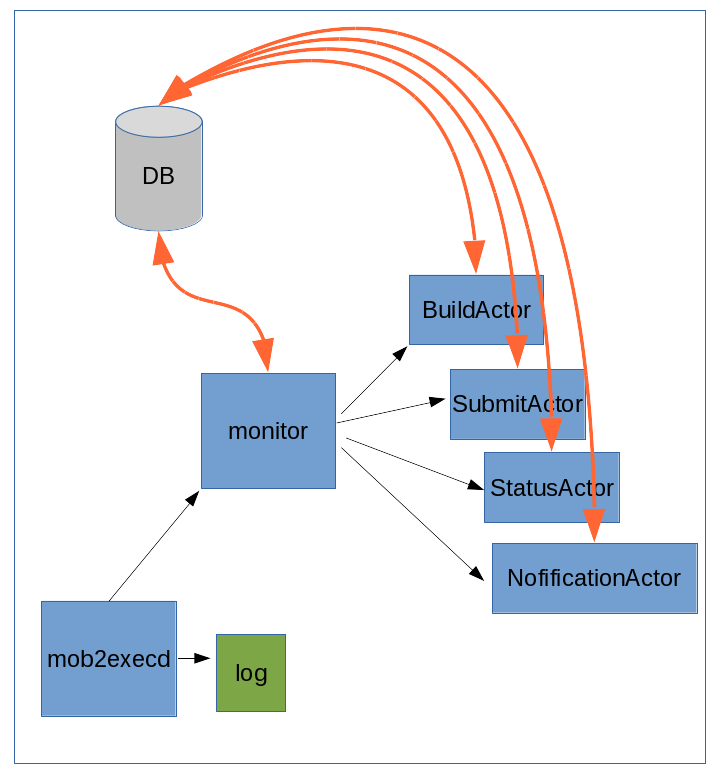

.. mobyle2.exec_engine documentation master file, created by
   sphinx-quickstart on Wed Nov  7 11:52:45 2012.
   You can adapt this file completely to your liking, but it should at least
   contain the root `toctree` directive.

Welcome to mobyle2.exec_engine's documentation!
===============================================

Overview
========
  
The role of the mobyle2.exec_engine is to get new job in the DB pushed by other parts of the projects (mobyle2.web for instance)
and execute the job, get the results and notify the owner of the job when this latter is ended.

Sources tree
------------

 * **bin** : contains all executable scripts notably *mob2execd* (the main entry point)
 * **execution_engine** : this package contains all package and module needed to execute jobs
  
   * **engine** : this package contains modules that form the core of the execution engine, the monitor and the actors
   
      * **monitor** : this module contains the Monitor and JobsTable classes.
      * **actor** : this module contains the abstarct classe base for all actors
      * **building_actor** : this module contains the BuildingActor class, which is in charge to prepare the job execution (build the working directory, build the command line, ...) 
      * **submit_actor** : this module contains the SubmitActor class, which is in charge to submit the job the the execution system
      * **status_actor** : this module contains the StatusActor class, which is in charge to query the executon system to know the status of a job
      * **notification_actor** : this module contains the NotificationActor class, which is in charge to notify the job owner that the job is ended.
   * **job_routing** : this package contains that needed to decide which job must be executed on which execution systems
      
      * **routing_rules** : this package contains function that help to route jobs
      * **route** : this module contains Rule, Route and Dispatcher classes
      * **rules** : this module is the core of the rules routing pluging system and register all rules neede to job routing
   * **systems** : this package contains all classes to deal with various excecution systems
      * **execution_systems** : this module contains the ExecutionSystems the abstract base classe for all excecution systems
      * **local** : to execute and manage jobs on the same machine as the engine
      * **drmaa** : contains the base class for all Distributed Resources Manager which can be reach through the DRMAA library 
      * **ogs** : to deal with cluster managed by OGS and family (Soge, ...)
      * **torque** : to deal with clusters managed by torque. 
   * **logger** : this module contains the logger which centralized the logs emmit by all process.
 
 
Execution Engine
----------------

   
     
.. container:: clearer

    .. image :: _static/figs/spacer.png

The main entry point is the ``mob2execd``. This module is a daemon and is in charge to instanciate the logger, and the monitor.
It also the component which we can interact with via signal or comand 'start' 'sotp' 'reload' (*not yet implemented*).
this component redirect the command to the other componant. The mobyleExecd is also in charge to check if other componant are alive
or not and restart them if nessecary.

The Monitor is also an independant process which run all mobyle2 exec engine life time.
It loop endless and at each turn it: 

* get jobs which are ``submitable`` in the DB and add them in a list of active jobs.
* following the state of the job start a new actor
* remove jobs which are ended from the active jobs.   
* for each job, start a new Actor according its status:

   * BuildingActor: prepare all needed to run a job: make the job directory, compute the command line ...
   * SubmitActor: get the right ExecutionSystem from a Dispacher and submit it 
   * StatusJob: get the right ExecutionSystem and job_num from the DB and ask to the ExecutionSystem the status for this particular job
   * NotificationActor: notify the owner of a job that the job is ended
   
Execution Systems
-----------------

All Execution system must implements the ExecutionSytem abstract class. and must implement run, get_status, kill methods.
Mobyle provide 3 systems:

* **Local** for execution locally on the same machine than the engine, without any drm.
* **torque** for execution *via* torque drm
* **ogs** for execution *via* Open Grid Engine or similar drm (soge, ...)

For ``Torque`` and ``Ogs`` ExecutionSystem Mobyle rely on DRMAA library. 
So these 2 classes inherits from DRMAA class.

There is also a plug'in system which allow the Mobyle administrator to add his own ExecutionSystem.
The class mus be place in a module in *execution_systems* directory and be registered with the execution_system.register decorator 

.. code-block:: python
   
   from mobyle.common.job import Status
   from mobyle.execution_engine.systems import execution_systems
   
   @execution_systems.register
   class MySystem( execution_systems.ExecutionSystem):
      
      def run(self, job):
         do something
         
      def get_status(self, job):
         do something
         return Status()
         
      def kill(self, job)
         do something
         
         
Job routing
-----------

Routing the jobs through the right execution system is based on kind of objects:

   * **Rules** : a rule is a code executable which take one argument, a job and return True of False.
   * **Route** : associate a list of rules and an execution systems
   * **Dispatcher** : have a method which_route which take a job as argument and return the right route.
   
The Dispatcher have a liste of route. Each time we call wich_route the dispatcher loop over the route,
and for each route loop over the rule, the first rule wich return True is return.

The Mobyle administrator can add rules *via* a plug'in systems. the new modules must been in *routing_rule* directory at the root of the Mobyle Project.
The rules which have as first argumant a job and can have several keywords arguments. These functions must be registered 
with rules.register decorator     

.. code-block:: python

   from mobyle.execution_engine.job_routing import rules

   @rules.register
   def my_rule(job):
      do something

   @rules.register
   def his_rule(job, param1 = None):
      do something
      
      
      
how to test the engine
----------------------

Either you install the mobyle_exec_engine or define MOBYLE_HOME wich must point to root of
the mobyle2.exec_engine project.

The directory  **/tmp/mob2** must be create it will contained all "mob2" files.

* mob2.stderr : the stderr temporary file for debugging in production this flow will be redirect to /dev/null
* mob2.stdout : the stdout temporary file for debugging in production this flow will be redirect to /dev/null
* mob2_error.log : the "true" Mobyle logs (can be configure in mobyle.ini)
* mob2.pid : the pid file needed to communicate with mob2execd (can be configure in mobyle.ini)
* projects : contains all projects and jobs directory ("/tmp/mob2/projects" is set in sim_submission)

::
   
   python sim_submission.py -c ../../../mobyle2.conf/mobyle.ini

in a other terminal
   
::

   ./mob2execd -c ../../../mobyle2.conf/mobyle.ini start
   
in *top* 2 or 3 processes are always running :

* mob2_master : one of the processes is the mob2execd daemon the other is a thread execut by mob2execd to run the TCPlogReciever
* monitor : is the jobs "scheduler"

and several process which have a shorter life time  mob2_build, mob2_submit, mob2_status, mob2_notification that correspond to the different actors

sim_submission will create 3 projects and 3 users and will create 500 jobs which are push in mongoDB randomly.
every 0 to 5 seconds the script add 0 to 3 new jobs in the DB.

to stop the sim_submission scripts Ctrl-C ::

   ./mob2execd -c ../../../mobyle2.conf/mobyle.ini stop
   
Mobyle execution engine API documentation
=========================================
.. toctree::
   :maxdepth: 2
   
   master
   monitor
   actor
   build_actor
   submit_actor
   status_actor
   notification_actor
   execution_systems
   local
   drmaa
   ogs
   torque
   route
   rule
   
   

Indices and tables
==================

* :ref:`genindex`
* :ref:`modindex`
* :ref:`search`

